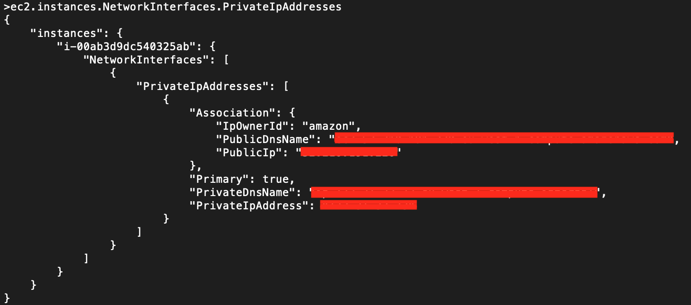

# AWS Metadata CLI

# Requirements

You will need the following to run this program:
- Python3.11
- Pre-preppared IAM user account

# Build the program

build the program with:
```bash
make build
```

# Setup Env vars

Run the command:
```bash
cp .env.copy .env
```

and fill out the appropriate values using an AWS IAM account
```
AWS_ACCESS_KEY_ID="<AWS ACCESS KEY>"
AWS_SECRET_ACCESS_KEY="<AWS SECRET ACCESS KEY>"
AWS_REGION="<AWS REGION>"
```

# Run the program

run the cli with:
``` bash
make run
```

## Example Usage:
See the following example:

